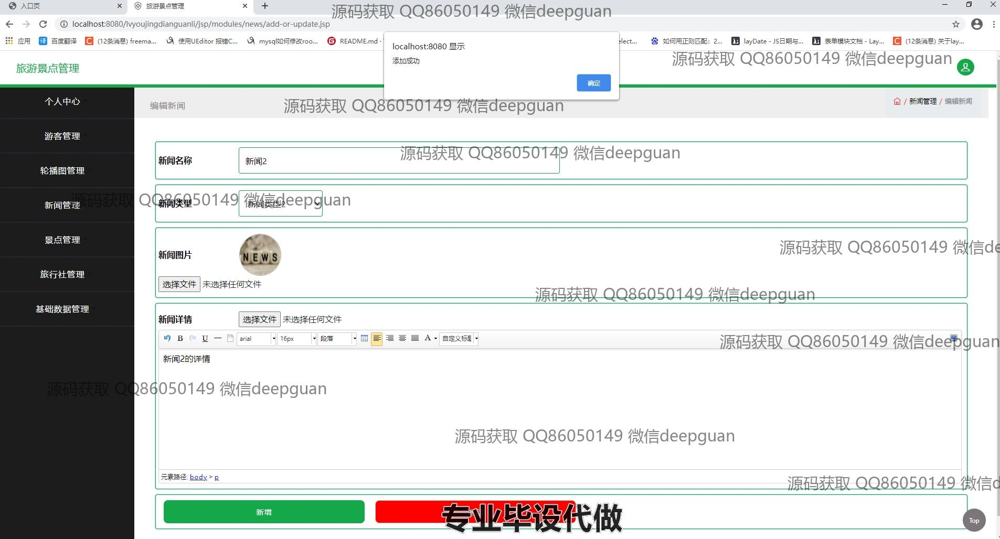
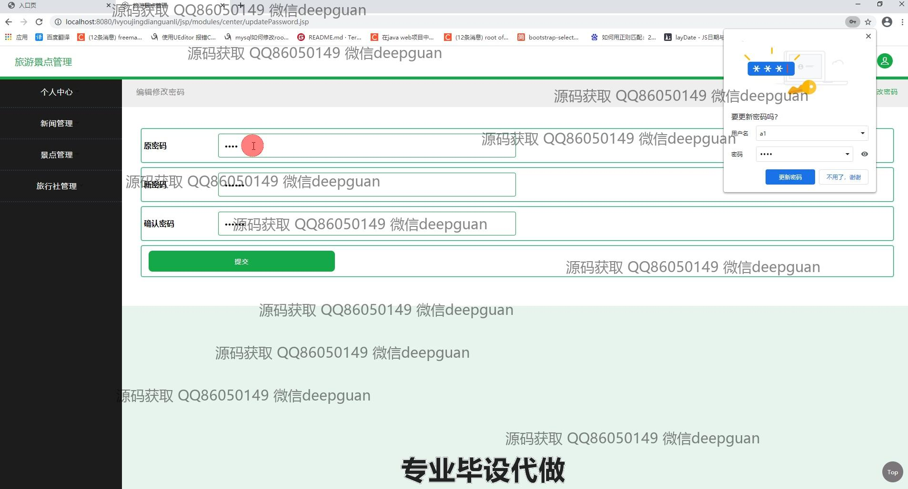

<h1 align="center">旅游景点管理系统设计</h1>

## 简介
旅游景点管理系统：提供景点信息管理、游客管理、新闻管理和旅行社管理等功能，支持用户个人中心、新闻编辑、景点评价与留言管理，多功能模块提升系统操作便捷性与管理效率。    --计算机毕业设计源码；毕设源码；java毕业设计源码

## 联系方式

<h3 align="center">获取完整代码与数据库文件 + 微信：deepguan QQ: 86050149 QQ群: 783742310</h3>

<h3 align="center">可帮忙远程部署 包运行成功！提供远程部署、修改代码、设计文档指导、代码讲解等服务！</h3>

## 功能介绍（完整见运行截图）
管理员：基本功能包括登录、注册和退出，支持用户信息的管理如游客账号、手机号和身份证信息的编辑；提供对景点、轮播图、新闻、旅行社等模块的增删改查操作；支持景点类型、等级等基础数据的分类管理和批量操作，方便系统整体维护与更新。

游客：基本功能包括登录、注册和退出；可以在网站首页通过导航栏浏览景点、旅行社、新闻等信息，使用搜索功能快速查找感兴趣的景点或新闻；支持收藏功能，用于管理个人收藏的景点和旅行社信息；在个人中心中可以查看和修改个人信息，包括头像上传、性别选择和联系方式更新。

旅行社管理员：可通过管理界面添加或编辑旅行社信息，包括旅行社名称、等级、位置、相关景点和联系人信息；支持上传旅行社相关图片及文件，查看与管理游客留言和反馈；可以执行查看、修改、删除等操作，优化旅行社的资源管理。

新闻编辑员：负责新闻内容的管理，支持新增新闻、选择新闻类型、上传新闻图片并编辑详细内容；提供新闻搜索和过滤功能，方便分类查看和管理；支持新闻的编辑和发布，确保系统中的内容实时更新。

## 运行截图

本代码来源于网络,仅供学习参考使用!

